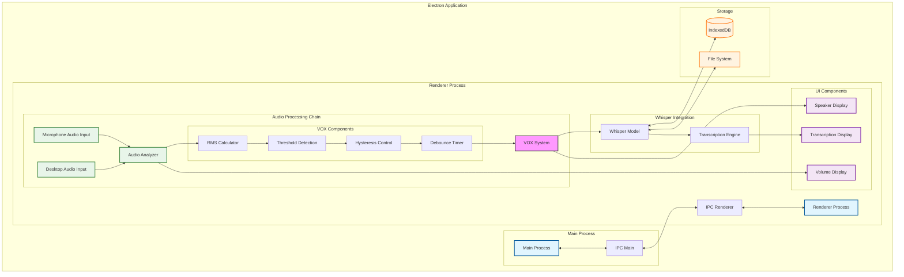

# Architecture Diagram

This diagram illustrates the main components and data flow of the Real-time Local Speech-to-Text system with VOX-Style Speaker Detection. Key features include:

## Main Components

1. **Audio Processing Chain**
   - Dual audio input (Microphone and Desktop)
   - VOX system with hysteresis and debounce
   - RMS-based level detection
   - Professional-grade frequency analysis

2. **Speaker Detection**
   - Threshold-based detection
   - Anti-chatter system
   - Real-time speaker switching

3. **Transcription System**
   - Local Whisper model
   - Real-time processing
   - Offline operation

4. **Storage System**
   - IndexedDB for model storage
   - Local file system integration

## Data Flow

- Audio signals are processed through the VOX system
- Speaker detection influences transcription segmentation
- All processing happens locally within the Electron renderer process
- Main process handles system integration and file operations

## Technical Notes

- The VOX system (highlighted in pink) represents the core innovation
- Electron's IPC system handles cross-process communication
- Storage systems manage model persistence and file operations
- UI components provide real-time feedback and display
